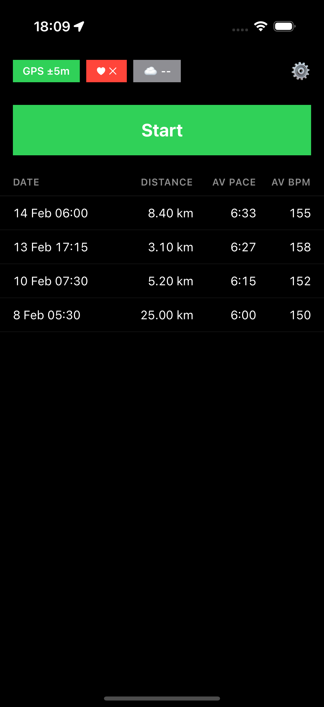
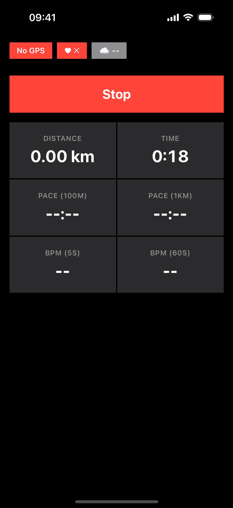
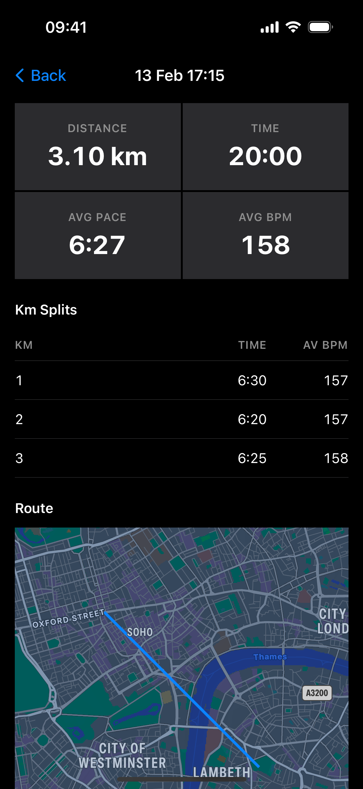
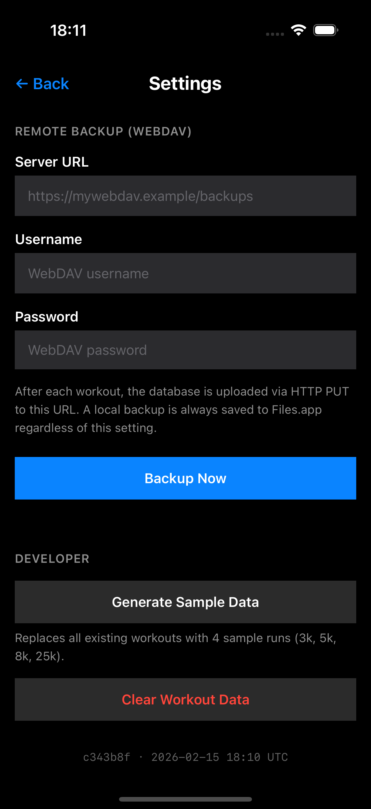

# Hard Way Home

A lightweight run tracker for iOS

## Features

### Quiet
* No popups
* No subscriptions
* No AI
* No social features
* No animations
* No update treadmill
* Only two screens, only one important button

### Functional
* Heart-rate tracking, auto-reconnect, no faff
* Filters GPS track to reduce random noise
* Shows 1km split times

### Reliable
* Shows heart-rate monitor and gps state front-and-center
* Runs in background, but will recover a workout-in-progress if needed

### Yours
* No spying (data stays on device, or syncs to your webdav server)
* Open source
* Simple, open data format (Sqlite, 3 tables)

## Screenshots

## Tech

Yep, built by robots (with guidance, but without review). Seems to work, but I wouldn't trust your life to this.

## Getting Going

Plug your phone in, do scripts/deploy.sh 

## FAQ

### Why doesn't it have rounded corners and transparency effects?

I think a better question would be "why is it that everything else does?"

### Why WebDav? Isn't that from 1996?

*You* try getting iCloud to sync reliably.

